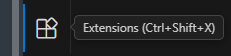
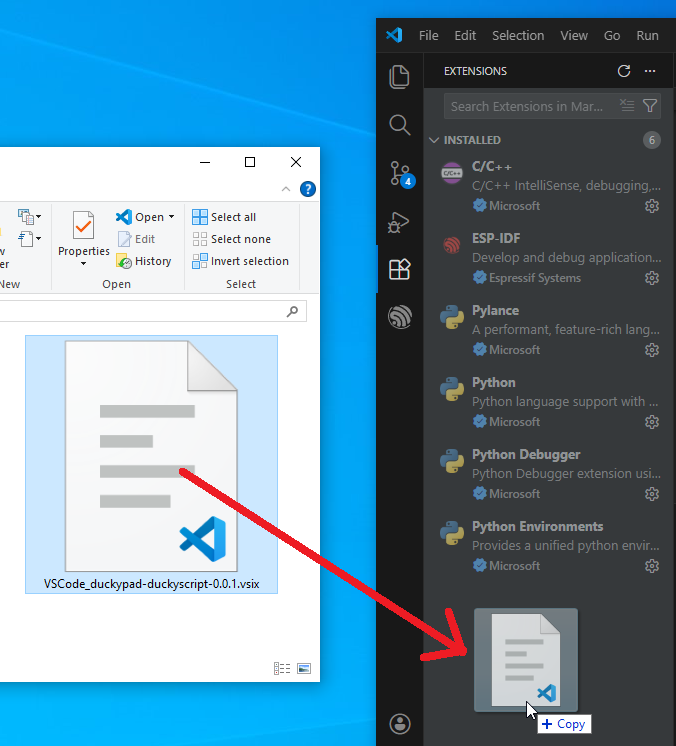

# duckyPad duckyScript Syntax Highlighter

Provides **syntax highlighting** and **smart snippets** for **duckyScript** on [duckyPad macropads](https://duckypad.com).

Recommended when writing **longer and more complex** scripts.

## Install: Visual Studio Code

* [Download Latest Release](https://github.com/duckyPad/duckyScript-Syntax-Highlighter/releases/latest)
	* Pick `VS Code`
* In VS Code side bar, click `Extension` icon.

* Drag the `.vsix` file into the extension list

---

* Press `CTRL+SHIFT+P`
* Start typing `Change Language Mode`, press enter.
* Start typing `duckyPad duckyScript`, press enter. 

## Install: Sublime Text

* [Download Latest Release](https://github.com/duckyPad/duckyScript-Syntax-Highlighter/releases/latest)
	* Pick `Sublime Text`
* Unzip
* In Sublime Text menu bar, select **`Preference -> Browse Packages...`**
* Drag **`duckypad_duckyScript`** folder **AS-IS** into the window just opened

----------

* Press `CTRL+SHIFT+P`
* Start typing "duckyPad" 
* Select `Set Syntax: duckyPad-duckyScript`

## Build

`vsce package`